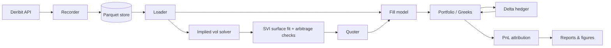

# BTC Options Market-Making Simulator

An event-driven backtester for market making in BTC options, built on real Deribit order book and trade data. It fits an arbitrage-checked SVI volatility surface, quotes two-sided markets across the option chain, manages inventory in Greeks space, delta-hedges with the underlying future, and decomposes daily PnL into edge, gamma, theta, vega and hedging cost.

> **Status:** 🚧 In development. Numbers in the Results section are filled in as each stage is validated.

---

## Why this project

A single-asset market maker (e.g. Avellaneda–Stoikov) quotes one price and manages one inventory number. An options market maker quotes hundreds of contracts at once, and the risk that matters is not contract count but the aggregate **delta, gamma and vega** of the book. This project answers three questions on real data:

1. How well can a parametric surface (SVI) price the Deribit BTC option chain, and how often do market quotes violate no-arbitrage?
2. Given transaction costs, which discrete delta-hedging rule gives the best trade-off between hedging cost and PnL variance?
3. After hedging, where does a market maker's PnL actually come from — spread capture, or an implicit bet on realized vs. implied volatility?

---

## Highlights

- **Real market data:** order book snapshots and trades recorded from the Deribit public API
- **Pricing:** Black-76 on the future, analytic Greeks, robust implied-vol solver (Newton with Brent fallback)
- **Volatility surface:** per-expiry raw SVI fit, butterfly and calendar arbitrage checks, total-variance interpolation across maturities
- **Market making:** surface-based fair value, vega- and gamma-aware spreads, inventory skew by vega bucket
- **Hedging:** fixed-interval, fixed delta-band and Whalley–Wilmott-style band rules, with fees and slippage
- **PnL attribution:** Taylor-expansion decomposition validated on simulated paths before use on real data
- **Tested:** unit tests for parity, Greeks vs. finite differences, IV round-trips, arbitrage detection and attribution residuals

---

## Architecture



The backtest engine is event-driven: book updates, trades, surface refits and hedge checks are processed in timestamp order, so the simulator never uses information that would not have been available at that moment.

---

## Repository structure

```
btc-options-market-making/
├── README.md
├── pyproject.toml
├── configs/
│   └── backtest.yaml            # spread, hedging and risk-limit parameters
├── data/                        # git-ignored
│   ├── raw/                     # recorded Deribit books and trades
│   └── processed/               # cleaned parquet files
├── src/btc_options_mm/
│   ├── data/
│   │   ├── deribit_client.py    # REST / WebSocket client
│   │   ├── recorder.py          # continuous book + trade recorder
│   │   └── loader.py            # timestamp alignment, filtering
│   ├── pricing/
│   │   ├── black76.py
│   │   ├── greeks.py
│   │   └── implied_vol.py
│   ├── surface/
│   │   ├── svi.py
│   │   ├── fit.py
│   │   ├── arbitrage.py
│   │   └── interpolate.py
│   ├── hedging/
│   │   ├── strategies.py
│   │   └── hedger.py
│   ├── mm/
│   │   ├── quoter.py
│   │   ├── inventory.py
│   │   └── fill_model.py
│   ├── backtest/
│   │   ├── events.py
│   │   ├── portfolio.py
│   │   └── engine.py
│   └── analytics/
│       ├── pnl_attribution.py
│       ├── metrics.py
│       └── plots.py
├── scripts/
│   ├── record_deribit.py
│   ├── fit_surface.py
│   └── run_backtest.py
├── tests/
├── notebooks/
│   ├── 01_surface_exploration.ipynb
│   ├── 02_hedging_study.ipynb
│   └── 03_mm_backtest.ipynb
└── reports/
    ├── figures/
    └── report.md
```

---

## Methodology

### 1. Pricing

Deribit BTC options are European and settle against the BTC index. Each option is priced with **Black-76** on the forward $F$ implied by the matching futures contract:

$$
C = e^{-rT}\left[F\,N(d_1) - K\,N(d_2)\right], \qquad
d_{1,2} = \frac{\ln(F/K) \pm \tfrac12 \sigma^2 T}{\sigma\sqrt{T}}
$$

Deribit quotes option premiums in BTC (inverse contracts), so prices are converted between BTC and USD terms consistently before inverting for implied volatility. Greeks are computed analytically and tested against finite differences.

### 2. Implied volatility

Implied vol is solved with Newton's method using vega, falling back to Brent's method when vega is small (deep ITM/OTM or very short expiries). Quotes are filtered before fitting: crossed or empty books, prices below intrinsic value, and extremely wide spreads are dropped.

### 3. Volatility surface (SVI)

For each expiry, total implied variance $w(k) = \sigma^2(k)\,T$ is fitted as a function of log-moneyness $k = \ln(K/F)$ using raw SVI:

$$
w(k) = a + b\left(\rho\,(k-m) + \sqrt{(k-m)^2 + \sigma^2}\right)
$$

Fits are vega-weighted, so liquid near-the-money options dominate. Two no-arbitrage conditions are checked:

- **Butterfly (within an expiry):** Durrleman's condition $g(k) \ge 0$, equivalent to a non-negative risk-neutral density
- **Calendar (across expiries):** $w(k, T)$ non-decreasing in $T$ for every $k$

Between listed expiries the surface is interpolated linearly in total variance, which preserves the calendar condition.

### 4. Market making

Fair value comes from the fitted surface. Around it, the quoter sets

- **half-spread** as a base width plus terms scaling with the option's vega and gamma, so riskier contracts are quoted wider;
- **skew** from current inventory, measured as net vega in maturity buckets and net delta. When the book is long vega in a bucket, quoted vols in that bucket are shifted down to attract buyers.

Hard risk limits on net vega, net gamma and per-contract position pause quoting on the affected side.

Two fill models are supported:

| Model | Description | Use |
|---|---|---|
| Poisson | Fill intensity $\lambda(\delta) = A e^{-\kappa \delta}$ in distance from fair value | Fast sanity checks, parameter sweeps |
| Trade replay | Our quote is filled when a recorded market trade prints through it | Main results |

### 5. Delta hedging

Portfolio delta is hedged with the BTC future or perpetual. Rules compared:

| Rule | Trigger |
|---|---|
| Fixed interval | Rehedge every $\Delta t$ |
| Fixed band | Rehedge when $\lvert \Delta_{\text{port}} \rvert > h$ |
| Whalley–Wilmott band | Band width scales with gamma and transaction cost |

Each hedge trade pays fees and half the bid-ask spread of the hedge instrument.

### 6. PnL attribution

Over each step, portfolio PnL is decomposed by Taylor expansion:

$$
\text{PnL} \approx
\underbrace{\text{edge}}_{\text{spread capture}}
+ \underbrace{\Delta\, dF}_{\text{delta}}
+ \underbrace{\tfrac12 \Gamma\, dF^2}_{\text{gamma}}
+ \underbrace{\Theta\, dt}_{\text{theta}}
+ \underbrace{\mathcal{V}\, d\sigma}_{\text{vega}}
- \text{hedge costs}
+ \text{residual}
$$

For a delta-hedged position, gamma and theta combine to

$$
\text{PnL}_{\Gamma+\Theta} \approx \tfrac12\,\Gamma F^2 \left(\sigma_{\text{realized}}^2 - \sigma_{\text{implied}}^2\right) dt
$$

so a hedged market maker's PnL separates into the edge earned on each trade and an implicit position in realized vs. implied volatility. The attribution is first validated on simulated GBM paths, where the expected answer is known, and the residual is tracked as a quality check.

---

## Data

Data comes from the Deribit public API (no account required). Recorded fields:

- option and futures order book snapshots (top levels)
- ticker data including mark price and index price
- public trades

Historical order book snapshots are not freely available, so the recorder is designed to run continuously in the background and build the dataset over time. Raw data is stored as partitioned parquet by date and instrument.

```bash
python scripts/record_deribit.py --currency BTC --depth 10 --out data/raw
```

---

## Quickstart

```bash
git clone https://github.com/<your-username>/btc-options-market-making.git
cd btc-options-market-making

python -m venv .venv
source .venv/bin/activate
pip install -e ".[dev]"

pytest                                                            # run tests
python scripts/fit_surface.py --date 2026-10-01                   # fit and plot one day's surface
python scripts/run_backtest.py --config configs/backtest.yaml     # full backtest
```

Outputs are written to `reports/figures/`.

### Example configuration

```yaml
data:
  start: 2026-10-01
  end: 2026-10-31
  expiries: all
  min_open_interest: 10

surface:
  model: svi
  refit_interval: 5min
  weighting: vega

quoting:
  base_half_spread_vol: 0.5        # vol points
  vega_spread_coef: 0.0            # tune in parameter sweep
  gamma_spread_coef: 0.0
  inventory_skew_coef: 0.0
  quote_size: 1

risk_limits:
  max_net_vega: 0.0                # set per account size
  max_net_gamma: 0.0
  max_position_per_contract: 0

hedging:
  instrument: BTC-PERPETUAL
  rule: band                       # interval | band | whalley_wilmott
  band: 0.0

fill_model: replay                 # replay | poisson

costs:
  option_fee: 0.0                  # use the current Deribit fee schedule
  future_fee: 0.0
```

---

## Results

> To be filled in as each stage is validated. All figures are generated by `scripts/` and `notebooks/`.

### Volatility surface

| Metric | Value |
|---|---|
| Median SVI fit RMSE (vol points) | TBD |
| Share of snapshots with butterfly violations in raw quotes | TBD |
| Share of snapshots with calendar violations in raw quotes | TBD |


### Hedging study

| Rule | Mean hedge cost | PnL std. dev. | Number of hedges |
|---|---|---|---|
| Fixed interval | TBD | TBD | TBD |
| Fixed band | TBD | TBD | TBD |
| Whalley–Wilmott | TBD | TBD | TBD |


### Market-making backtest

| Metric | Value |
|---|---|
| Total PnL | TBD |
| Edge captured per contract | TBD |
| Sharpe (daily) | TBD |
| Max drawdown | TBD |
| Attribution residual (% of gross PnL) | TBD |


A full write-up is in [`reports/report.md`](reports/report.md).

---

## Testing

| Test | What it checks |
|---|---|
| `test_black76.py` | Put-call parity; Greeks match finite differences |
| `test_implied_vol.py` | Price → IV → price round-trip error below tolerance |
| `test_svi.py` | Fit recovers known parameters from synthetic smiles |
| `test_arbitrage.py` | Detects constructed butterfly and calendar violations |
| `test_attribution.py` | On simulated paths, attribution residual is small and hedged PnL matches the gamma-theta relation |

---

## Limitations

- **Queue position is not modelled.** Replay fills assume our quote is filled whenever the market trades through it, which is optimistic at the touch.
- **No market impact.** Our own quotes and hedges do not move the recorded market.
- **Latency is idealized.** Quote updates are assumed to take effect at the next event.
- **Single venue.** Cross-venue hedging and funding-rate effects on the perpetual are simplified.
- **Sample length** is limited by how long the recorder has been running.

These assumptions bias results upward; the report states each one next to the affected numbers.

---

## Roadmap

- [ ] Data recorder and loader
- [ ] Black-76 pricing, Greeks, implied vol solver
- [ ] SVI fitting and arbitrage checks
- [ ] PnL attribution validated on simulated paths
- [ ] Hedging rule comparison on real data
- [ ] Quoter, inventory manager and fill models
- [ ] Event-driven backtest engine
- [ ] Final report and figures
- [ ] Extensions: SSVI surface, SABR comparison, queue-position model, ETH options

---

## References

- Gatheral, J. (2006). *The Volatility Surface: A Practitioner's Guide.* Wiley.
- Gatheral, J., & Jacquier, A. (2014). Arbitrage-free SVI volatility surfaces. *Quantitative Finance*, 14(1).
- Avellaneda, M., & Stoikov, S. (2008). High-frequency trading in a limit order book. *Quantitative Finance*, 8(3).
- Whalley, A. E., & Wilmott, P. (1997). An asymptotic analysis of an optimal hedging model for option pricing with transaction costs. *Mathematical Finance*, 7(3).
- Sinclair, E. (2013). *Volatility Trading* (2nd ed.). Wiley.
- Deribit API documentation: https://docs.deribit.com

---

## Author

**Jingnan Huang** — Computer Engineering, University of Toronto

Related projects: HFT Order Book Engine (bare-metal RISC-V), Avellaneda–Stoikov Market-Making Simulator

## License

MIT
